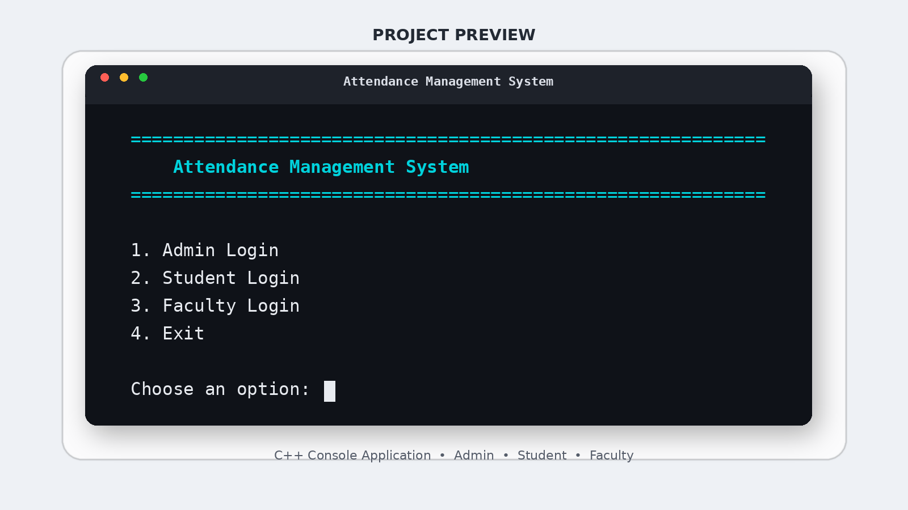

# Attendance Management System

A console-based **Attendance Management System developed in C++** that provides separate modules for **Admin, Student, and Faculty** users.

The project demonstrates practical use of C++ programming concepts including **file handling, vectors, structures, functions, data validation, CRUD operations, modular programming, and persistent data storage**.

---

## Project Preview

<p align="center">
  
</p>

---

## Features

### Admin Module

* Admin login
* Add, view, update, and delete students
* Add, view, update, and delete faculty members
* Create and manage courses
* Assign faculty members to courses
* View stored academic records

### Student Module

* Student login
* Register for available courses
* Drop registered courses
* View attendance records
* Check attendance percentage
* View attendance status
* Submit leave requests
* View leave request status

### Faculty Module

* Faculty login
* View assigned courses
* Mark student attendance
* View student attendance records
* Review student leave requests
* Approve or reject leave requests

---

## Attendance Monitoring

The system automatically calculates student attendance percentages.

Students falling below the required **75% attendance threshold** are identified so that attendance shortages can be monitored.

The system also provides:

* Attendance percentage calculation
* Text-based attendance visualization
* Attendance shortage identification
* Attendance-related fine calculation based on course credit hours

---

## Leave Management

Students can submit leave requests through the system.

Faculty members can then:

* View pending leave requests
* Approve requests
* Reject requests
* Update the status of submitted requests

---

## Technologies Used

* **C++**
* **C++17**
* Standard Template Library
* Vectors
* Structures
* Functions
* File Handling
* Text / CSV-style Data Storage
* Console-Based User Interface

---

## Programming Concepts Applied

* Structured Programming
* Modular Programming
* CRUD Operations
* File Input/Output
* Persistent Data Storage
* User Authentication Logic
* Data Validation
* Conditional Logic
* Loops
* Functions
* Structures
* Vectors
* Data Processing
* Problem Solving

---

## Project Structure

```text
Attendance-Management-System-CPP/
│
├── attendance_system.cpp
├── README.md
├── .gitignore
│
└── images/
    └── main-menu.png
```

The application creates and uses text-based files for storing system data such as students, faculty members, courses, attendance records, enrollments, leave requests, and administrator information.

---

## How to Compile

Make sure a C++ compiler supporting **C++17** is installed.

Using `g++`:

```bash
g++ -std=c++17 attendance_system.cpp -o attendance_system
```

Run the program on Linux/macOS:

```bash
./attendance_system
```

On Windows:

```bash
attendance_system.exe
```

---

## Main Menu

The program provides the following main options:

```text
1. Admin Login
2. Student Login
3. Faculty Login
4. Exit
```

Each type of user is redirected to a dedicated menu containing functionality relevant to their role.

---

## Data Storage

The system uses local text files to maintain persistent records.

Data handled by the application includes:

* Student records
* Faculty records
* Administrator records
* Course information
* Student enrollments
* Attendance records
* Leave requests

This allows information to remain available after the program is closed and reopened.

---

## Learning Outcomes

Developing this project provided practical experience with:

* Building a complete C++ console application
* Managing multiple user roles
* Designing menu-driven systems
* Working with persistent data
* Implementing CRUD functionality
* Processing attendance information
* Organizing application logic into reusable functions
* Debugging and validating user input
* Translating real-world requirements into software functionality

---

## Security Note

This project was developed for **academic and learning purposes**.

The login system demonstrates basic authentication logic. It is not intended to represent production-level security, and credentials should not be stored in plain-text files in a real-world application.

---

## Future Improvements

Possible future enhancements include:

* Graphical User Interface
* Database integration using MySQL or SQLite
* Password hashing
* Role-based access control
* Web-based dashboard
* Automated attendance notifications
* Advanced attendance analytics
* Exportable reports
* Improved error handling

---

## Author

**Hasher Hasanat**
BS Computer Science Student — Bahria University

**GitHub:** [github.com/h-hasanat](https://github.com/h-hasanat)
**LinkedIn:** [linkedin.com/in/h-hasanat](https://www.linkedin.com/in/h-hasanat/)
